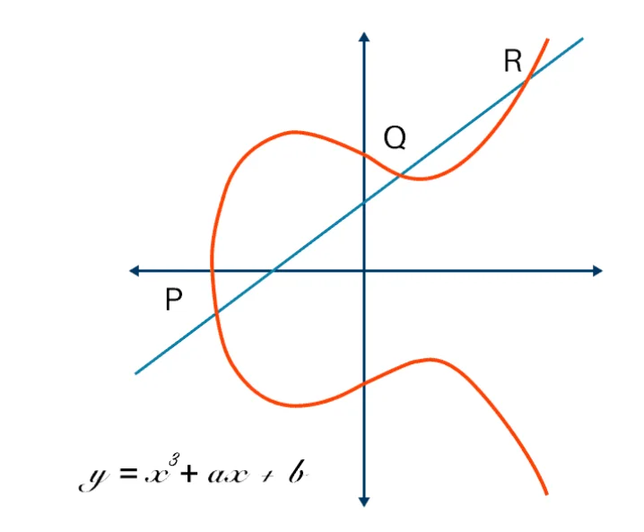

# DAO "Национальный технологический центр цифровой криптографии" Российской Федерации


Автор: **Муравьев Герман Валерьевич**

***ВСЕ ПРАВА ЗАЩИЩЕНЫ ПО СРЕДСТВУ ИСПОЛЬЗОВАНИЯ MIT ЛИЦЕНЗИИ***

**Примечание:** Статья подготовлена исключительно в образовательных и научных целях. 
Автор не несет ответственности за использование представленного алгоритма в целях, 
связанных с незаконной деятельностью, включая, но не ограничиваясь, передачей средств, 
имеющих сомнительное происхождение, через интернет-сети. 
Все риски, связанные с нарушением законодательства, возлагаются на пользователя.

## ⭐ Поддержите проект
Если вам понравился этот репозиторий, пожалуйста, поставьте ⭐! Это мотивирует работать над новыми улучшениями и поддерживать проект.

---

## Оглавление
- [Введение](#введение)
- [Глава 1: Введение в концепцию](#глава-1-введение-в-концепцию)
  - [Что такое нулевое знание?](#что-такое-нулевое-знание)
  - [Основная идея](#основная-идея)
  - [Основные свойства](#основные-свойства)
  - [Этап подготовки](#этап-подготовки)
- [Глава 2: Разбор нулевого знания](#глава-2-разбор-нулевого-знания)
  - [Основная гипотеза и вычислительная задача](#основная-гипотеза-и-вычислительная-задача)
  - [Этап подготовки](#этап-подготовки)
  - [Генерация доказательства](#генерация-доказательства)
  - [Верификация доказательства](#верификация-доказательства)
- [Глава 3: Процесс автоматизации](#глава-3-процесс-автоматизации)
  - [1. Создание необходимых папок](#1-создание-необходимых-папок)
  - [2. Компиляция схемы Circom](#2-компиляция-схемы-circom)
  - [3. Генерация входных данных](#3-генерация-входных-данных)
  - [4. Генерация свидетелей (witness)](#4-генерация-свидетелей-witness)
  - [5. Создание файла Powers of Tau (ptau)](#5-создание-файла-powers-of-tau-ptau)
  - [6. Настройка схемы и генерация ключей](#6-настройка-схемы-и-генерация-ключей)
  - [7. Церемония взноса и экспорт ключа](#7-церемония-взноса-и-экспорт-ключа)
  - [8. Генерация и проверка доказательства](#8-генерация-и-проверка-доказательства)
  - [9. Экспорт умного контракта](#9-экспорт-умного-контракта)
- [Глава 4: Описание Circom файла](#глава-4-описание-circom-файла)
  - [Эллиптические кривые (BN128)](#эллиптические-кривые-bn128)
- [Глава 5: Описание и запуск проекта](#глава-5-описание-и-запуск-проекта)
  - [Запуск](#запуск)
- [Заключение](#заключение)

---

## Введение

Меня зовут Герман, и я увлечен исследованием и созданием будущего в сфере цифровых финансов. Моя работа и интересы лежат на пересечении технологий, экономики, инвестиций и геополитики.

Я являюсь младшим криптографом и разработчиком, специализирующимся на цифровых финансах, блокчейне и вопросах безопасности в этой динамично развивающейся области.

В своих проектах я сосредоточен на инновациях и защите данных, стремясь объединить технологии и стратегическое видение для создания устойчивых решений в мире цифровой экономики.

В этой статье я намерен исследовать истоки анонимных и теневых транзакций в блокчейне, раскрывая их происхождение и влияние на экосистему.

---

## Глава 1: Введение в концепцию

### Что такое нулевое знание?

Нулевое знание (или протокол с нулевым разглашением — zero-knowledge proof) — это метод криптографии, 
который позволяет одной стороне (доказателю) убедить другую сторону (проверяющего) в том, 
что у неё есть определённая информация, не раскрывая саму эту информацию.

Принцип работы основан на том, что доказатель не раскрывает ни самой информации, ни вычислений, с помощью которых она была получена. 
Вместо этого он демонстрирует, что обладает необходимыми данными, 
проводя серию проверок, которые не позволяют узнать ничего лишнего.

Пример из реальной жизни: представьте, что вы знаете секретный код от сейфа, 
но хотите доказать это кому-то, не раскрывая сам код. Вы можете пройти через серию проверок, которые докажут, 
что вы действительно знаете код, не говоря, что это за код.


### Основная идея

Основная идея zk-SNARKs (Zero-Knowledge Succinct Non-Interactive Arguments of Knowledge) заключается в том, 
чтобы доказать, что вы обладаете некоторым знанием (например, знанием секрета или решением задачи), 
не раскрывая саму информацию, используя минимальное количество данных и времени.


### Основные свойства

**Сохранение конфиденциальности:** проверяющий ничего не узнаёт о содержимом доказательства.

**Достоверность:** если доказатель утверждает, что у него есть информация, он не может обмануть проверяющего.

**Интерактивность:** часто этот процесс включает несколько раундов общения между доказателем и проверяющим.

---

## Глава 2: Разбор нулевого знания

### Основная гипотеза и вычислительная задача

Сначала нам нужно определить задачу, для которой будет применяться zk-SNARK. 
Пусть у нас есть вычислительная задача: 

$$C(x, w) = 1$$

- **$x$** – публичный вход (данные, которые известны всем и будут проверяться).

- **$w$** – секретное знание (некое скрытое решение, которое мы хотим доказать, но не раскрыть).

Наша цель – доказать, что для входа $x$ существует секрет $w$, не раскрывая сам секрет $w$.

### Этап подготовки

На этапе подготовки (Setup) генерируются публичные параметры, 
которые понадобятся как для создания доказательства, так и для его проверки. 
Это включает:

**Параметры доверия** — специализированные криптографические параметры, 
которые генерируются с использованием ***протокола trusted setup***. 
Это могут быть криптографические ключи, 
которые обеспечат приватность и безопасность схемы.

На выходе этого этапа мы получаем два компонента:

1. **Публичные параметры** $pk$ (public key) – используются для проверки доказательства.
2. **Приватный ключ** $vk$ (verification key) – используется для создания доказательства.

### Генерация доказательства

Теперь переходим к самому процессу создания доказательства. 
Пусть у нас есть $x$ и секрет $w$, 
для которого нужно доказать выполнение $C(x, w) = 1$ 

Процесс состоит из нескольких этапов:

1. **Генерация полиномов:** Важно, что zk-SNARKs опираются на представление вычислений в виде полиномов. Пусть:
    - $P(x)$ — полином, который выражает вычисления, связанные с задачей.
    - $h(x)$ — вспомогательный полином, который помогает маскировать или скрывать детали решения. Это может быть связанный с трансформациями, необходимыми для обеспечения нулевого знания.
    - $Z(x)$ — полином, который часто связывается с доказательством того, что решение существует, не раскрывая его.
2. **Композиция полиномов:** Все эти полиномы комбинируются в один итоговый полином:
    - $f(x)$
        $$f(x) = P(x) * h(x) * Z(x)$$
        Это выражение комбинирует все важные вычисления, которые связаны с доказательством знания секрета $w$, 
        в один полином. Как правило, такие полиномы имеют свойства, которые позволяют скрывать секрет, но подтверждать его существование.
3. **Скрытие внутренней информации:** На этом этапе важно, чтобы доказательство скрывало сам секрет $w$. 
Это делается с помощью специальных криптографических операций, таких как перевод в нормальную форму, маскирование данных или использование вспомогательных значений для защиты приватности.
    
   В частности, для полиномов $P(x), h(x), Z(x)$ часто применяются техники **гомоморфизма** или **групповых операций** на эллиптических кривых, что позволяет сжать доказательство и сделать его "не интерактивным".
4. **Генерация доказательства $\pi$:** В результате комбинирования всех полиномов и маскирования генерируется краткое доказательство
   $\pi$, которое передается на следующую стадию — верификацию. 

### Верификация доказательства
На этапе верификации задача состоит в том, чтобы проверяющий убедился, что доказательство $\pi$ 
действительно соответствует утверждению, 
не раскрывая при этом секретного знания $w$.

Проверка доказательства сводится к нескольким вычислениям с использованием публичных параметров и самого доказательства $\pi$:
1. **Билинейная пара** 

    Центральным элементом проверки является использование билинейных отображений на эллиптических кривых, таких как тестирование билинейной пары. 

$$e(P_1, P_2) = e(Q_1, Q_2)$$

- $e$ – билинейное отображение на эллиптической кривой.

- $P_1, P_2$ – точки, связанные с полиномами $P(x), h(x), Z(x)$ (которые были сгенерированы на этапе доказательства).

- $Q_1, Q_2$ – публичные параметры из этапа настройки (Этап подготовки), которые необходимы для проверки. (Это проверка того, что сгенерированное доказательство действительно соответствует вычислениям, которые были проведены для входных данных $x$)
  
2. **Проверка корректности:** Если пара $e(P_1, P_2) = e(Q_1, Q_2)$ выполняется, это означает, что доказательство $\pi$
   является корректным и что существует решение $w$, которое удовлетворяет $C(x, w)=1$.
3. **Безопасность и нулевое знание:** На этом этапе важно, что проверка доказательства не раскрывает самого секрета
   $w$, а только удостоверяет, что его существование соответствует публичным данным
   $x$. Это свойство называется нулевым знанием (zero-knowledge), так как проверяющий не узнает ничего о решении, кроме того, что оно действительно существует.

---

## Глава 3: Процесс автоматизации

Данный проект автоматизирует процесс работы с библиотекой Circom и SNARK-прувами для генерации доказательств, 
проверки их и экспорта данных для использования в смарт-контрактах. Рассмотрим детально каждый шаг:

#### 1. Создание необходимых папок
```shell
$  mkdir -p ${DATA_DIR}/keys ${DATA_DIR}/proof_data ${DATA_DIR}/witnesses ${COMPILED_DIR} ${PRODUCT_JS_DIR}
$  mkdir ${CONTRACTS_DIR}
```

#### 2. Компиляция схемы Circom
**Circom** компилирует схему в несколько форматов:

***.r1cs***: описание схемы в виде системы ранжированных ограничений.

***.wasm***: WebAssembly-код для генерации свидетелей.

***.sym***: описание переменных схемы.

***--c***: генерирует код на C для альтернативной вычислительной среды.

```shell
$  circom ${CIRCUIT_NAME}.circom --r1cs --wasm --sym -o ${COMPILED_DIR} --c
```

#### 3. Генерация входных данных
```shell
$ cat > ${INPUT_FILE} <<EOL
  {
      "a": "1",
      "b": "2",
      "c": "1",
      "x": "-1"
  }
EOL
```
Создает JSON-файл с входными значениями для уравнения
$$ax^2 + bc + c = 0$$

#### 4. Генерация свидетелей (witness)

```shell
$  node ${PRODUCT_JS_DIR}/generate_witness.js ${PRODUCT_JS_DIR}/product.wasm ${INPUT_FILE} ${WITNESS_FILE}
```

#### 5. Создание файла Powers of Tau (ptau)

```shell
$  snarkjs powersoftau new bn128 12 ${PTAU_FIRST_FILE} -v
$  snarkjs powersoftau contribute ${PTAU_FIRST_FILE} ${PTAU_SECOND_FILE} --name="Первый ptau взнос" -v
```
Powers of Tau — подготовительный шаг для использования SNARK:
1) ***new***: создает начальный файл для выбранной эллиптической кривой (bn128) с параметром степени
2) ***contribute***: добавляет случайный вклад в файл, чтобы обеспечить безопасную настройку.

#### 6. Настройка схемы и генерация ключей

```shell
$  snarkjs powersoftau prepare phase2 ${PTAU_SECOND_FILE} ${PTAU_FINAL_FILE} -v
$  snarkjs groth16 setup ${COMPILED_DIR}/product.r1cs ${PTAU_FINAL_FILE} ${ZKEY_FIRST_FILE}
```

1) ***prepate phase2***: переводит Powers of Tau в фазу, привязанную к схеме.
2) ***groth16 setup***: генерирует начальный набор параметров (zkey).

#### 7. Церемония взноса и экспорт ключа
```shell
$  snarkjs zkey contribute ${ZKEY_FIRST_FILE} ${ZKEY_SECOND_FILE} --name="Первый zkey взнос" -v
$  snarkjs zkey export verificationkey ${ZKEY_SECOND_FILE} ${VERIFICATION_KEY_FILE}
```
1) ***zkey contribute***: добавляет случайный вклад для приватности.
2) ***export verificationkey***: экспортирует ключ для проверки доказательств.

#### 8. Генерация и проверка доказательства
```shell
$  snarkjs groth16 prove ${ZKEY_SECOND_FILE} ${WITNESS_FILE} ${PROOF_FILE} ${PUBLIC_FILE}
$  snarkjs groth16 verify ${VERIFICATION_KEY_FILE} ${PUBLIC_FILE} ${PROOF_FILE}
```
1) ***prove***: создает доказательство и публичные данные.
2) ***verify***: проверяет доказательство с помощью публичного ключа.

#### 9. Экспорт умного контракта
```shell
$  snarkjs zkey export solidityverifier ${ZKEY_SECOND_FILE} ${VERIFIER_SOL_FILE}.sol
```
Генерирует Solidity-контракт для проверки доказательств на блокчейне.

---

## Глава 4: Описание Circom файла

```circom
pragma circom 2.0.0;

template Equation() {
    signal input x;
    signal input a;
    signal input b;
    signal input c;

    signal ax2;
    signal bx;
    signal result;

    ax2 <== x * x;
    bx <== b * x;
    result <== a * ax2 + bx + c;

    result === 0;
}

component main = Equation();
```
1) Входные сигналы: $x, a, b, c$.
2) Промежуточные переменные: $ax^2, bx$ и результат: $ax^2 + bx + c$
3) Условие: $ax^2 + bx + c = 0$

#### Эллиптические кривые (BN128)
Используются для криптографической безопасности

Уравнение кривой: $ y^2 = x^3 + 3$



Операции:
1) Скалярное умножение: $Q = k * P$, где $P$ – точка на кривой, $k$ - скаляр
2) Групповая операция: $R = P + Q$

Данные операции используются для генерации параметров, доказательств и проверки

---

## Глава 5: Описание и запуск проекта

### Запуск

Для того чтобы запустить и проверить данный алгоритм, выполните следующие шаги:
1) Установка Rust (https://www.rust-lang.org/tools/install)
 ```shell
$  curl --proto '=https' --tlsv1.2 -sSf https://sh.rustup.rs | sh
  
# После установки перезапустите терминал или выполните:

$  source $HOME/.cargo/env 
```

2) Для работы с проектом, использующим JavaScript и инструмент snarkjs, необходимо установить Node.js. Для этого выполните следующие шаги:

```shell
# MacOS
$   brew install node

# Ubuntu / Debian:
$   sudo apt update
$   sudo apt install nodejs npm

# установка snarkjs
$   npm install -g snarkjs
$   snarkjs --version
```

3) Сборка проекта
```shell
$ cargo install

$ cargo build
  
$ cargo run
```

---

## Заключение
В данном проекте мы исследовали алгоритм и шаги, необходимые для его запуска и тестирования в среде разработки Rust. 
С помощью инструментов, таких как cargo, мы обеспечили удобную и эффективную сборку и запуск приложения.
Следуя представленным инструкциям, вы сможете легко настроить и запустить проект на своей машине, 
а также внести изменения и улучшения в будущем. 

Также язык программирования Rust предоставляет мощные инструменты для разработки высокопроизводительных и безопасных приложений, и этот проект лишь малое представление о возможностях, 
которые он открывает для разработчиков.
